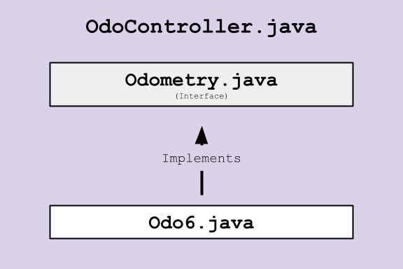
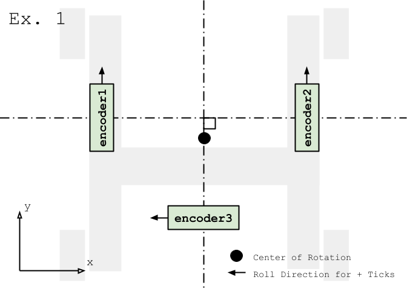
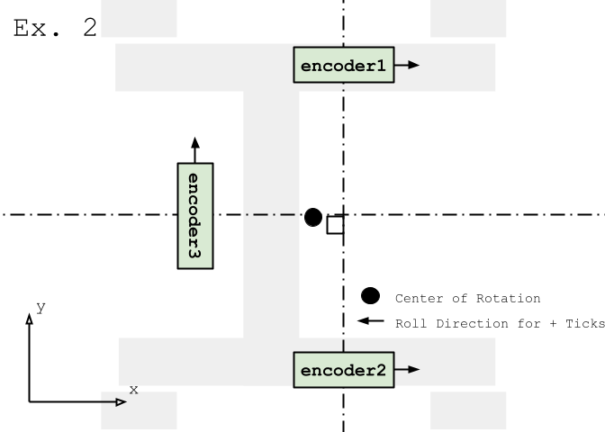

# Kai W's Odometry Guide
By Kai Wallis

## About the Classes
The following guide is organized by the class hierarchy, but I recommend starting with [Odometry.java](#odometryjava)
and [Odo6.java](#odo6java). This example is designed to function on PowerPlay 1 robot with the "OdoTesting" TeleOp.

### [OdoController.java](OdoController.java) :robot:
The OdoController.java class holds an [Odometry.java](#odometryjava) object. The OdoController.java class is where you
configure details related to encoder positions & rotation, and also passes the changes in each encoder position to the
[Odometry.java](#odometryjava) object.

The OdoController class preforms the following:
 - Constructs an Odometry object which implements the [Odometry.java](#odometryjava) interface. In this example,
[Odo6.java](#odo6java) is stored in the Odometry object "odo".
 - Updates an Odometry object using the update() method (which is specified by the interface) each system loop.

My example OdoController class also does the following:
 - Stores and retrieves data from encoders to calculate the change in encoder positions. (Alternately, this data could
be passed down from a parent class.)
 - Passes data up from the Odometry object, including the object's calculated field pose, x, y, and heading. (Highly
recommended, unless data is used locally and not needed in the class this object is derived from.)

For details on tuning the constructor of an [Odo6.java](#odo6java) object, see its section.

### [Odometry.java](Odometry.java)
The Odometry.java interface defines the methods used to update and retrieve data for tracking a robot's position and
heading on the field. While the implementing class defines the calculation methods, in this case [Odo6.java](#odo6java),
this interface ensures consistency with the data an implementing class receives and returns.

The calculations performed by the implementing class are based off the change in rotation of three encoders
(dead wheels) and the robot's previous fieldPose. The change in encoder positions are measured in ticks (stored as
integer values). The robot's fieldPose is stored as a Pose2D object representing the robot's current x and y
positions, along with the heading. My code measures the x & y positions in cm (see [Odo6.java](#odo6java) for more
details). The heading must be measured in Radians, convert to degrees if needed for easier reference.

The implementing class' required methods are defined as such:

#### _update(int encoder1, int encoder2, int encoder3)_
 - Updates the robot's fieldPose based on the change of the encoder wheels' rotation (since the last execution of the
_Update()_ method).
 - The order each encoder's change in position is passed should be consistent with that defined by the implementing
class.
 - The _Update()_ method also returns the robot's newly updated fieldPose (see [_getFieldPose()_](#getfieldpose))

#### _getFieldPose()_
 - Returns the fieldPose. This will not update the robot's fieldPose, instead using that calculated by the last call of
the [_update()_](#updateint-encoder1-int-encoder2-int-encoder3) method.
 - Because the _update()_ method uses previously calculated fieldPose data to determine its new fieldPose,
getFieldPose() will be relative to the last fieldPose defined by
[_setFieldPose(Pose2D newPose)_](#setfieldposepose2d-newpose). (Implementing classes such as [Odo6.java](#odo6java) may
also define a starting fieldPose in their constructor.)

#### _getDeltaPose()_
 - Returns a Pose2D object representing the latest change in the object's fieldPose. This is the differance between the
current fieldPose and previous fieldPose.

#### _setFieldPose()_
 - Changes the robot's perceived fieldPose to an x of 0.0, y of 0.0, and heading of 0.0.
 - All future fieldPose values will be relative to the robot's current position.

#### _setFieldPose(Pose2D newPose)_
 - Updates the robot's current fieldPose to equal that of the Pose2D object given.

### [Odo6.java](Odo6.java)
Implementing the [Odometry.java](#odometryjava) interface, Odo6.java solves for the relationship between the change in
encoder wheel rotation and change in robot position using linear algebra. Given that the position of each encoder
on the robot is tuned properly, Odo6.java can convert the changes in encoder ticks to the changes in the robot's pose.

The robot's fieldPose is tracked on a 2-dimensional plane plus heading. The orientation of this plane is determined by
setting a startingPose (defining the robot's position/orientation in on the plane) or using
[_setFieldPose(Pose2D newPose)_](#setfieldposepose2d-newpose) (redefining the robot's position/orientation in on the
plane).

Two constructors are given. One adds the ability to change the robot's starting fieldPose, but they do not vary
otherwise. The following details all parameters and the tuning required for Odo6.java to function accurately:

#### startingPose (optional)
 - Use the startingPose parameter if you to set the 2D plane arrangement or heading.
 - This parameter takes a Pose2D object which represents the robot's x & y position relative to the origin on a 2D plane
and the robot's heading relative to heading 0.0 (as defined by
[encoder1Pose, encoder2Pose, & encoder3Pose](#encoder1pose-encoder2pose--encoder3pose)). I recommend creating a new
Pose2D object with the Pose2D(double x, double y, double headingRad) constructor.
 - The x & y positions can be measured in any unit of distance (assuming consistency) but I have used centimeters
in this example. The Pose2D constructor requires radians, so use the Math.toRadians() method if needed to
convert.
 - Tuning will only affect the placement of the 2D plane the position is tracked on.

#### encoder1Pose, encoder2Pose, & encoder3Pose
 - Here is where the fun begins.
 - These parameters represent the position and orientation of three dead wheels used to calculate the robot's
position. As all calculations are based on their relative position to each other, the positions given when creating the
Odo6.java object must be highly accurate. Once the positions are defined, tuning is required. The better the tuning, the
more accurate the robot's position will be tracked.
 - Note: The encoder positions can be listed in any order. However, the data passed in the
[Update()](#updateint-encoder1-int-encoder2-int-encoder3) method must from the encoders in the same order.

Example Configurations
 - Facing y-axis:

 - Facing x-axis:

 - Example configurations are operational on the PowerPlay 1 robot. (Example constructors are in the
   [OdoController.java file](OdoController.java), one is commented out.)

Setting Initial Encoder Positions

1. For the math in this code to work, The encoders need to be positioned correctly relative to each other. Requirements
are as follows:
   1. Two wheels must spin on the same axis.
   2. A third wheel's axis must cross the midpoint between the first two wheels. The third wheel's distance from said 
   midpoint is not required to be the same as between the midpoint to wheel 1/2.
    - Note: You may be able to break the wheel arrangements beyond I just listed. Feel free to test configurations
   using different constructors. When the program is run, all invalid configurations will throw the runtime error
   "Current wheel arrangement is invalid."

2. Before defining the positions of each individual encoder, we need to define a 2D plane the robot's dead wheel
positions will be recorded on.
   1. Consider which direction you want the robot to face with a heading of 0.0. To ensure "forward" movement is along
   the desired axis, imagine the robot is facing the direction you want to be forward.
   2. During tracking, a single coordinate location is given representing the robot's position. Whichever point on the
   robot you would like to track, this is the origin of your 2D plane. I use the robots' center of rotation.
   3. Imagining the robot still faces "forward," all encoder positions can be recorded relative to this plane in any
   distance unit (again assuming consistency across all measurements of distance). Record the x & y values of each
   dead wheel on this plane.

3. Now each dead wheel's heading needs to be defined.
   1. Start by recording the direction of travel each encoder registers positive ticks.
   2. Record the angle the wheel must be rotated clockwise to register positive ticks moving out along the positive
   x-axis (on the plane defined in step 2).

4. Each dead wheel's position and rotation is defined by a Pose2D object. Use the Pose2D(double x, double y, double
headingRad) constructor as shown on lines 17-19 in the [OdoController.java](OdoController.java) file. Use the x, y, and
heading values found in steps 2 & 3 and pass this object as a parameter.

5. The values you just recoded are not accurate enough. Test them. There will be large amounts of drift, but movement
should be recorded. If it does not appear to be recording properly, you've probably done something wrong. Consult the
example constructors in the [OdoController.java](OdoController.java) file.

Tuning Encoder Positions

1. First, know what distances to tune. (Using encoder numbering in examples)
    - Increase distance between encoders 1 & 2: Decreases sensitivity of rotation, increases sensitivity to strafing in
   direction of wheel roll. (opposite axis than below).
    - Increase distance between encoder 3 and the midpoint between encoders 1 & 2: Decreases sensitivity of rotation,
    increases sensitivity to strafing in direction of wheel roll (opposite axis than above).
    - Increase all distance to midpoint: Decreases sensitivity of rotation.
    - & Vice Versa!

2. Place the robot down, mark its position on the field, and run your code! Ensure you have readouts for its x, y, and
heading relative to it's starting position (exclude [startingPose](#startingpose--optional-)). Spin the robot in place
one full rotation and return to its original starting position (keeping the extra rotation). Tune the distances until
the x & y values are ~0.0 & the heading is equal to around one full rotation (~6.2832 rad or ~360 deg).
    - This is take a lot of time. Tuning will work differently depending on your robot's orientation, position reference
   point, and dead wheel positions.
    - Tip: By changing the position reference point (see setting initial encoder positions), you can move the reference
   point away from the center of rotation and detect drift in the x & y. If tuned properly, it will register the same
   coordinates once the robot has completed its rotation.

3. Repeat step 2 until tracking is mostly accurate & consistent.

4. Repeat step 2, but rotating twice until the tracking is accurate & consistent.

5. This will take time and experience, which means you will not get it immediately. Don't worry if it takes a while.

Good luck!

#### encoderDiameter
 - This is the diameter of the dead wheels attached to every encoder. Just like the distance measurements of the
startingPose and encoderPoses, the distance can be measured in any unit (assuming consistency) but I have used
centimeters.
 - Odo6.java does not support mixed diameters of dead wheels. Smaller wheels rotate more times compared to larger
wheels over the same distance (more ticks over a shorter distance = more accuracy), but do not compromise the wheel's
ability to roll smoothly and stay in contact at all costs.
 - Tuning this parameter will scale the amount of distance the wheels register traveling, changing everything. Use
manufacturer's specification if possible.

#### ticksPerRev
 - This is the number of ticks the encoder registers per full revolution of the dead wheel. Consult the encoder
manual.